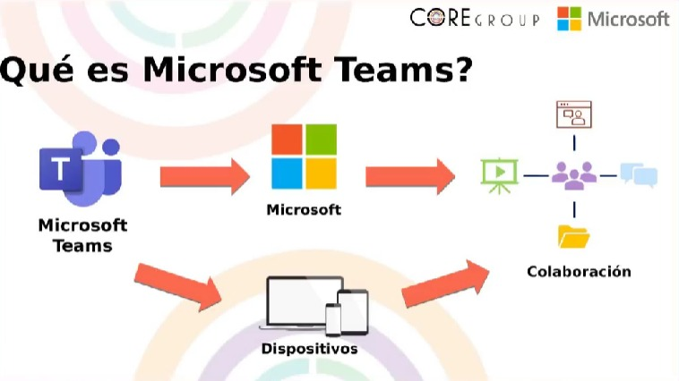
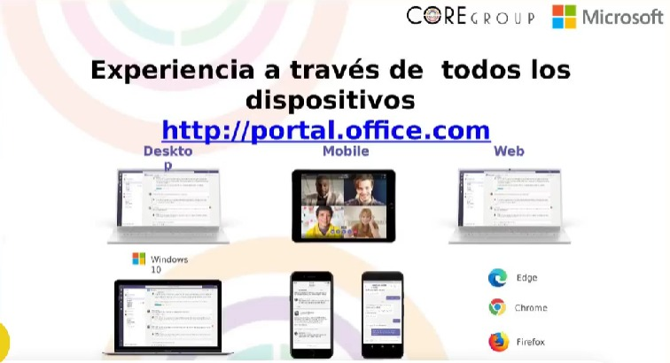
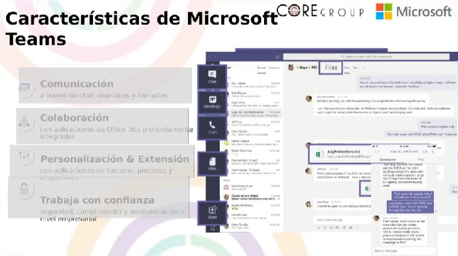

# Aprende a utilizar Teams en las entrevistas laborales

### Microsoft Teams es una plataforma de comunicación y colaboración empresarial desarrollada por Microsoft. Fue lanzada en 2017 como parte de la suite de herramientas de productividad de Microsoft 365 (anteriormente conocida como Office 365). La plataforma está diseñada para facilitar la comunicación, la colaboración y la coordinación entre equipos de trabajo, ya sea en entornos corporativos, educativos u organizativos.

Nota: Se recomienda utilizar Microsoft Teams en Microsoft Edge, Google Chrome o Firefox. Sin embargo, no se recomienda en Opera por incompatibilidades de la aplicación web.

Nota: Se añadió recientemente en Microsoft Teams la supresión de fondo y ruido, asi como también el uso de filtros de Snapchat.

### Características:

- Chat en tiempo real.
- Canales.
- Videollamadas y conferencias.
- Integración con herramientas de Microsoft.
- Aplicaciones y complementos.
- Automatización con Microsoft Power Platform.
- Seguridad y cumplimiento.
- Aplicación móvil.