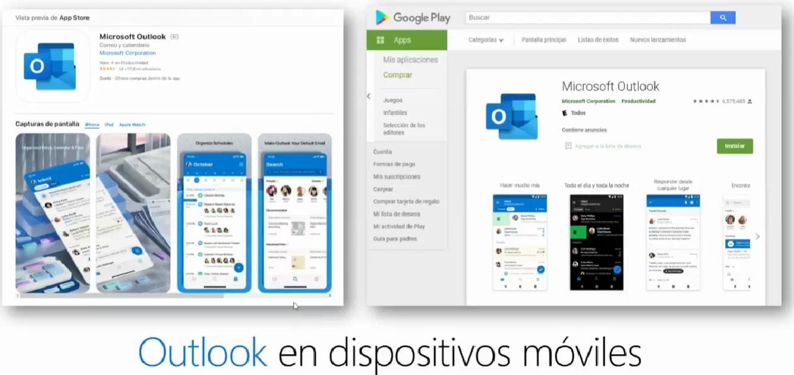
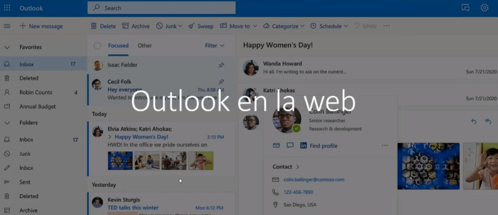

# Capacitación Outlook Aprende a utilizar Outlook como todo un crack.

Outlook es una plataforma de software creada por Microsoft que ofrece una variedad de servicios de comunicación y productividad. Aunque a menudo se asocia con el cliente de correo electrónico, Microsoft Outlook abarca más que solo el correo electrónico y tiene varias funciones y características útiles.

Nota: Tambien se tiene disponible una versión de escritorio. la cual incluye algunas opciones adicionales.

### Características:

- Correo Electrónico.
- Calendario.
- Contactos.
- Tareas y Notas.
- Integración con Microsoft 365.
- Funciones de Productividad.
- Seguridad.
