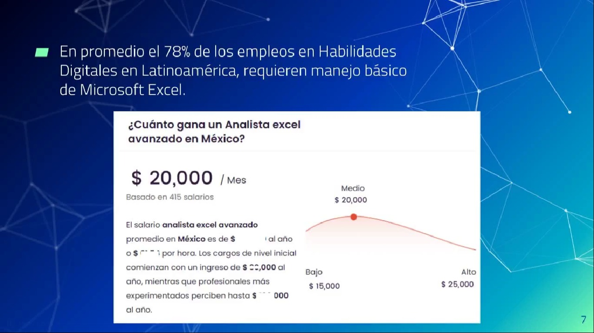

# Novedades de la paquetería office.

Microsoft Office 🠮 Microsoft 365

# Microsoft Excel.

Es una herramienta del conjunto Microsoft 365 de herramientas de ofimática que permite crear hojas de cálculo, análisis y estructura de datos.

# Enlace al Webinar:

https://www.facebook.com/redporlaciberseguridad/videos/1460713061428052

### Conceptos básicos.

| Columna  
\*- Fila

### Comandos.

Divide el texto en 2 partes, esto a partir de un espacio.

    =DIVIDIRTEXTO(B2, " ")

Divide el texto en 2 partes y solo muestra la primera palabra.

    =TEXTOANTES(B2, " ")

Muestra lo que está después del segundo espacio.

    =TEXTODESPUES(B2, " ", 2)

Muestra los datos de manera horizontal.

    =ENFILA(C2:C31)

Muestra los datos de manera vertical.

    =ENCOL(B1:G1)

Muestra la fecha del dia de hoy.

    =HOY()

Sumamos dos valores, el costo unitario y la cantidad vendida.

    =SUMA(F2,G2)
    =SUMA([@[Costo Unitario]]:[@[Cantidad Vendida]])

Multiplicamos dos valores, el costo unitario y la cantidad vendida.

    =[@[Costo Unitario]]*[@[Cantidad Vendida]]

Multiplicamos dos valores, el costo sin IVA y el valor absoluto del IVA.

    =[@[Total sin IVA]]\*$L$2

Sumamos dos valores, el total sin IVA y el IVA.

    =[@[Total sin IVA]]+[@IVA]

Condicional, si el total es mayor a 12000 se factura, caso contrario no.

    =SI([@Total]>120000,"SE FACTURA", "NO SE FACTURA")

### Prompts Chat GPT.

- Dame una lista de 20 productos que se vendan en una mueblería para colocarlos en una columna en un archivo de excel

- Ahora dame una lista de precios para los productos anteriores en pesos mexicanos.

- Solo quiero los precios.

- Quiero los costos en número sin texto antes del signo $

### Atajos.

Ctrl + E, Ctrl + T
